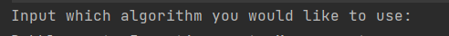

# **Sort Manager Project**
## Overview
___
This project was created to allow a user to sort a randomised array.
___
**Installation requirements**
- JDK [Java JDK download](https://www.oracle.com/java/technologies/downloads/) `18.0.1.1` was used but any version should suffice
- Junit dependency `5.8.2` was used for this project
- log4j api & core `5.8.2` was used for both

**How to use**
- Run the main class and follow instructions given on the console 

**Breif insight into project structure**
- MVC basic pattern, using a controller (SortManager), view (DisplayManager) and model (Model)
- Tests can be run idependently of each other

### **In use**
`sortedArray = sorter.sortArray(randomArray)`

`view.prompt("Sorted array one: "+ Arrays.toString(sortedArray));/` 

Will print to the console `Sorted array one: [5, 20, 21, 47, 58]`

###  Assumptions made
- Duplicate values will still be sorted, not removed
- User will only compare 2 algorithms
- The comparison of the algorithms will be done on the same arrays

## License

[MIT](https://choosealicense.com/licenses/mit/)
